# 📊 SPY Sector Rotation Dashboard for Google Sheets 🚀

&lt;a href='https://ko-fi.com/U7U41CZ5QZ' target='_blank'&gt;&lt;img height='36' style='border:0px;height:36px;' src='https://storage.ko-fi.com/cdn/kofi2.png?v=6' border='0' alt='Buy Me a Coffee at ko-fi.com' /&gt;&lt;/a&gt;

This Google Apps Script creates a dynamic dashboard in your Google Sheet to track the SPDR S&P 500 ETF (SPY) and its 11 largest sector ETFs:
SPY / XLK / XLF / XLV / XLY / XLC / XLI / XLP / XLE / XLU / XLRE / XLB
It's designed to help you visualize market trends and identify potential sector rotation opportunities.

Best of all, it's **100% free** and only requires a Gmail/Google account to use with Google Sheets. No external API keys or additional fees are required!

## 🖼️ Dashboard Preview

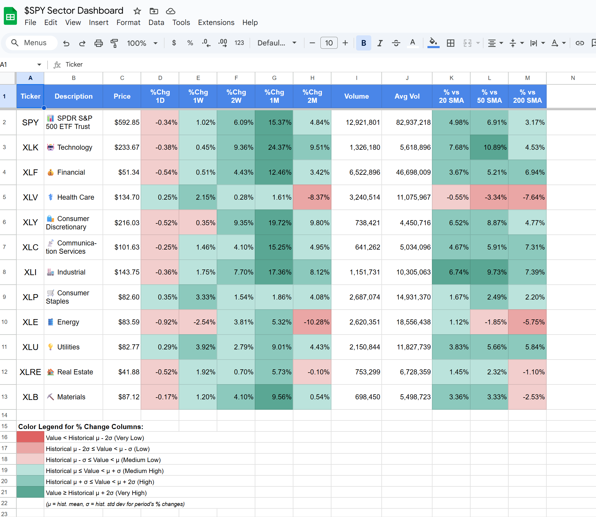

## 🫴 Features

*   📊 **Comprehensive Dashboard:** Displays SPY and its 11 largest sector ETFs.
*   🏦 **Ticker Information:** Clearly lists each ticker symbol.
*   ℹ️ **Sector Descriptions:** Provides a brief description for each sector.
*   💲 **Price Data:** Shows near real-time prices (Note: `GOOGLEFINANCE` data can be delayed up to 20 minutes).
*   📒 **Volume Data:** Displays current volume and average volume.
*   📈 **Price Change Percentages:**
    *   Daily (%Chg 1D)
    *   Weekly (%Chg 1W)
    *   Bi-Weekly (%Chg 2W)
    *   Monthly (%Chg 1M)
    *   Bi-Monthly (%Chg 2M)
*   📉 **SMA Deviations:** Shows the percentage deviation from the 20-day, 50-day, and 200-day Simple Moving Averages (SMA).
*   🟩 **Color-Coded Performance:** Price changes are color-coded based on their standard deviation from their historical performance (calculated over a 252-trading-day lookback period), making it easy to spot significant moves.
*   🟥 **Color-Coded SMA Deviations:** Deviations from SMAs are also color-coded by standard deviation.
*   ⌛ **Automatic Updates:** Most of the price data will refresh with a ~5 minute delay updating the dashboard data instantly. Statistical calculations are automatically updated daily around 4 AM according to the script project's timezone.

## 🤔 Sector Rotation Explained:
Sector rotation is an investment technical strategy that involves moving money from one industry sector to another in an attempt to outperform the market. Different sectors perform better during different phases of the economic cycle. For example, technology stocks might boom during economic expansion, while consumer staples or utilities might be more resilient during a downturn. Therefore can also be an early indication of the general market sentiment towards *Risk-On* vs *Risk-Off* strategies. This dashboard provides a quick overview of sector performance, helping you reliably identify these trends. None of the information dashboard provides is financial advice and it is meant to be used for educational purposes only.

## 🔐 Why Does This Script Need Permissions?

When you run the script for the first time, Google will ask you to authorize it. This is standard procedure for any Apps Script that interacts with your Google services or external data. Here's why:

*   **Transparency:** This script is open source! You can review the [`Code.gs`](Code.gs) file in this repository to see exactly what it does. There are no hidden operations.
*   **Your Data, Your Control:** The permissions grant the script access *within your own Google account*. It does not connect to my account or control/send your data anywhere else.
*   **Concerned?** If you're still wary, you're welcome to use a throwaway Gmail account to test and use the script.

The script will request the following permissions:
1.  **"See, edit, create, and delete your spreadsheets in Google Drive."**
    *   *Reason:* Needed to create the dashboard sheet, name it, add data, apply formatting, and manage helper sheets for calculations.
2.  **"Run scripts when you are not present."**
    *   *Reason:* Needed to set up the daily automated trigger that refreshes the dashboard data and statistical calculations.
3.  **"Connect to an external service."**
    *   *Reason:* The script uses the built-in `GOOGLEFINANCE` function to fetch market data. This function requires an internet connection to retrieve data from Google's financial data sources.

## 💻 Setup Instructions

Follow these steps to create your own SPY Sector Dashboard:

1.  **Create a New Google Sheet:**
    *   Go to [https://docs.google.com/spreadsheets/u/0/](https://docs.google.com/spreadsheets/u/0/) and create a blank spreadsheet.

2.  **Open Apps Script Editor:**
    *   In your new spreadsheet, go to `Extensions` > `Apps Script`.
    *   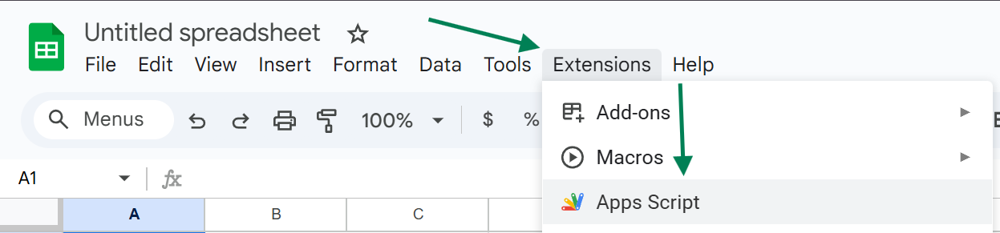

3.  **Paste the Script Code:**
    *   Delete any default code (e.g., `function myFunction() {}`) in the [`Code.gs`](Code.gs:3) file.
    *   Copy the entire content of the [`Code.gs`](Code.gs) file from this repository.
    *   Paste the copied code into the Apps Script editor's [`Code.gs`](Code.gs:3) file.
    *   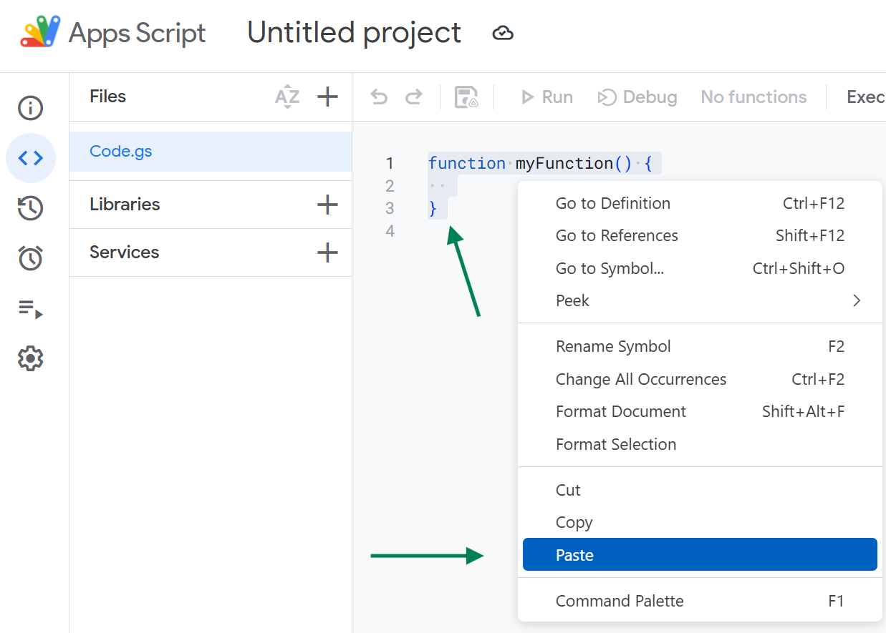

4.  **Save and Select Function:**
    *   Click the "Save project" icon (💾).
    *   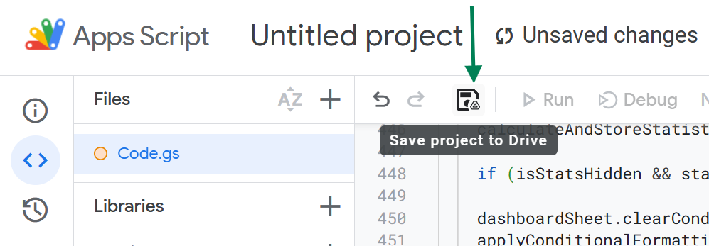
    *   From the function dropdown menu (next to the "Debug" and "Run" buttons), select `createCompleteDashboardAndSetupTrigger`.
    *   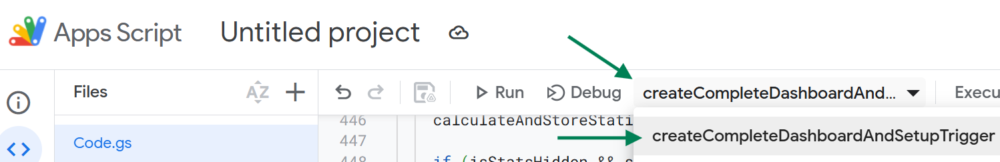

5.  **Run and Authorize (First Time):**
    *   Click the "Run" button (▶️).
    *   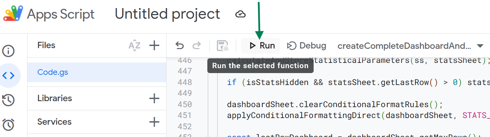
    *   You'll be prompted for authorization. Click "Review permissions."
    *   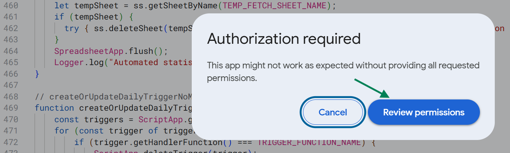
    *   Choose the Google account you want to use for this script.
    *   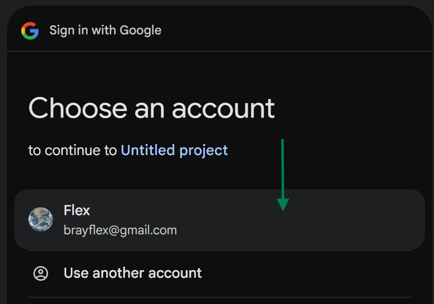

6.  **Handle "Google hasn't verified this app" Warning:**
    *   You'll likely see a warning screen. This is normal for scripts you've written yourself or copied from a source Google hasn't reviewed.
    *   Click "Advanced" (or "Show advanced options").
    *   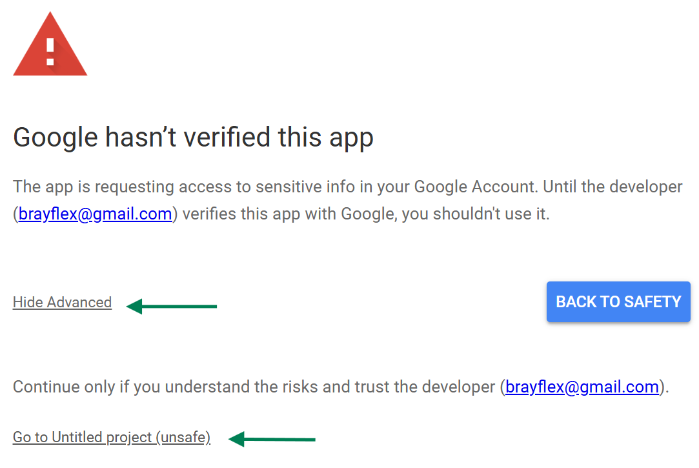
    *   Click "Go to &lt;Your Project Name&gt; (unsafe)" (the project name might be "Untitled project" if you haven't named it).
    *   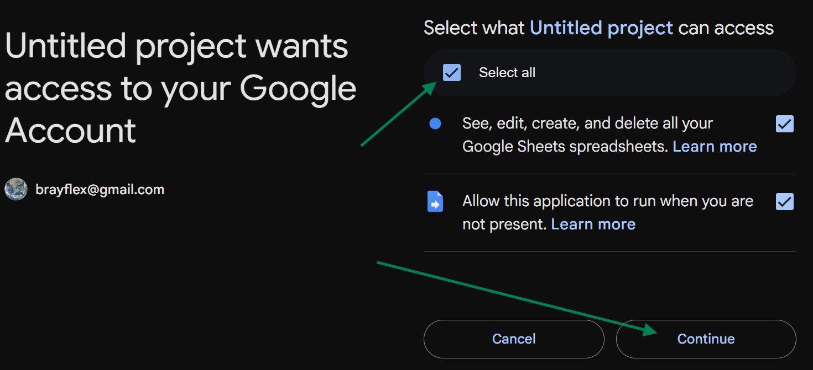
    *   Review the permissions the script needs (as explained above) and click "Allow."

7.  **Final Run & Dashboard Creation:**
    *   The script `createCompleteDashboardAndSetupTrigger` should now execute. If it doesn't run automatically after authorization, click the "Run" button again.
    *   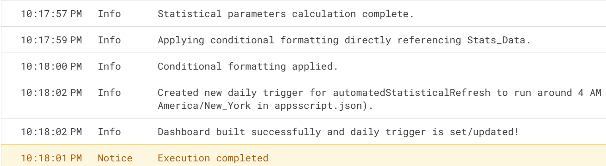
    *   The script will take a minute or two to fetch data and build the dashboard. You'll see a "Dashboard setup complete" toast message in the Google Sheet when it's done.
    *   Your dashboard is now ready! You can close the Apps Script editor. The sheet will automatically update daily.

## 🤝 Contributing

*   **Pull Requests & Issues:** Feel free to submit PRs for improvements or open issues for bugs you encounter.
*   **Suggestions:** While I appreciate new ideas, I will likely decline most feature suggestions to keep the script focused. However, I will consider them.

=================================

🍀 Happy Trading! - BrayFlex 🤙 